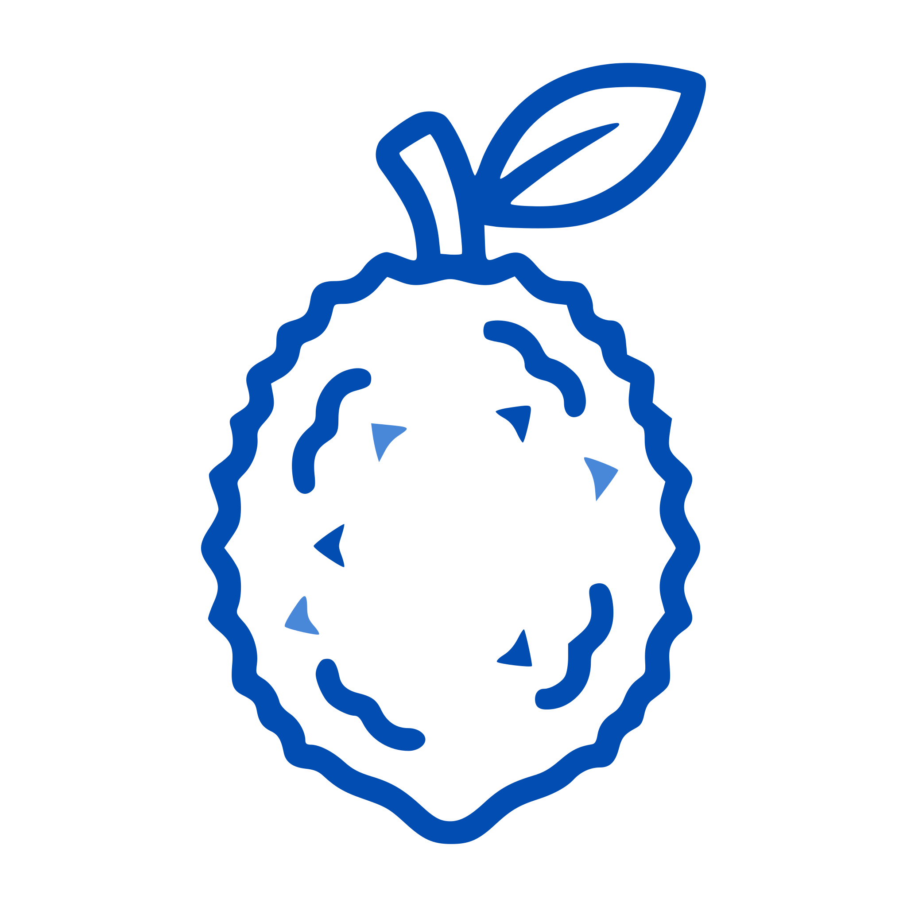

  

<h1 align="center">Jackpoll</h1>

  Open-source surveys and quizzes — build, share, and analyze them. 
  Use the hosted version at <a href="https://jackpoll.org">jackpoll.org</a>, or self-host it yourself.

  <a href="https://jackpoll.org">Website</a> ·
  <a href="https://github.com/jackpoll-org/jackpoll">App</a> ·
  <a href="https://github.com/jackpoll-org/jackpoll-selfhost">Self-hosting</a>

---

## Repositories

| Repo | What it is |
|---|---|
| [jackpoll](https://github.com/jackpoll-org/jackpoll) | The app monorepo — Next.js/Capacitor frontend (web, iOS, Android) and the Quarkus REST API backend. |
| [jackpoll-selfhost](https://github.com/jackpoll-org/jackpoll-selfhost) | Docker Compose / Swarm stacks, env templates, and the Keycloak realm for running your own instance. No application source — pulls the published images. |
| [jackpoll-landing](https://github.com/jackpoll-org/jackpoll-landing) | The marketing site at jackpoll.org, including the open-source Supporters page. |

## Tech stack

Next.js + Capacitor (web, iOS, Android) · Quarkus 3 / Java 21 · PostgreSQL · MinIO · Keycloak (OIDC) · Redis

## License

MIT, across all repos above.

## Contact

[contact@jackpoll.org](mailto:contact@jackpoll.org)
